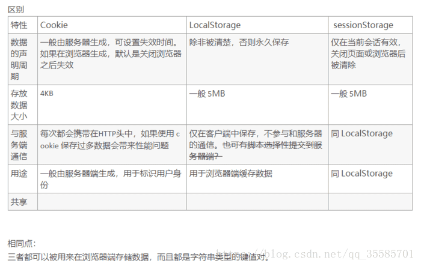
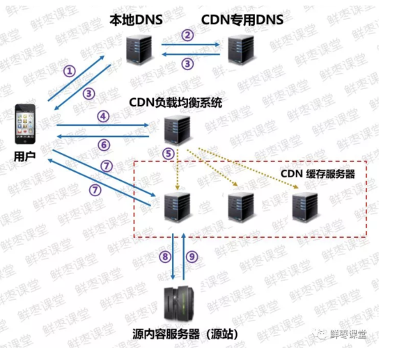

### 1. 浏览器进程
进程是资源分配的最小单位，线程是资源调度的最小单位。
- 主进程
- GPU进程
- 第三方插件进程
- 浏览器内核（5个线程）
    - 渲染引擎
    - JS引擎
    - 定时器线程
    - 异步请求线程
    - 事件触发线程

### 2. cookie、localStorage、sessionStorage


localStorage有事件通知机制，window.onStorage用来监听localStorage的变化

### 3. 跨域
由于浏览器的同源策略，同源策略要求源相同才能正常进行通信，即协议、域名、端口号都完全一致。  
跨域并不是请求发不出去，请求能发出去，服务端能收到请求并正常返回结果，只是结果被浏览器拦截了。

- Jsonp:利用`<script>`标签的跨域特性，可以不受限制的从其他域下加载资源，缺点是只支持get请求，类似的还有img标签。
    ```
    function jsonP(url, callback, success){
            let script = document.createElement('script');
            script.type = 'text/javascript';
            script.src = url;
            window[callback] = function(data){
                success && success(data);
                document.removeChild(script);
                delete window[callback];
            }
            document.appendChild(script);
        }
    ```
- window.postMessage向其他window对象发送消息
- CORS:
    设置头部：Access-Control-Allow-Origin: *
- 服务器处理、nginx代理

### 4. 内存泄漏
- 意外的全局变量
- dom引用，dom删除时，对其的引用没有清除
- 定时器没有及时清除
- 闭包
- 事件监听

### 5. 从输入URL到页面展示过程
- 浏览器查看是否有强缓存；
    - 强缓存
        - Expires：资源的有效期，是http1.0的产物，受限于本地时间；
        - Cache-Control：是http1.1的产物
            - public：客户端和代理服务器都可以缓存
            - private：只有客户端可以缓存
            - no-store：禁止缓存
            - no-cache：客户端可以缓存内容，但是是否使用缓存要经过协商缓存来决定
            - max-age：缓存的有效期
    - 协商缓存
        - Last-Modified：资源的最后修改时间，客户端发送请求时会带上If-Modified-Since这个字段，如果与服务器相同返回304，否则返回200和更新后的资源；
            - 当文件只是打开没有更改时，这个时间也会改变
            - 最小粒度只到s，s以内的改动无法检测到
            - http1.0
        - ETag：当前资源的唯一标识，只要资源有变化，服务器就会重新生成这个值。客户端发送请求时会带上If-None_Match这个字段，如果与服务器相同返回304,否则返回200和更新后的资源。
            - http1.1
     
- DNS解析
    - 浏览器有没有域名缓存
    - 系统host文件有没有域名缓存
    - 路由器缓存
    - ISP缓存
    - 迭代查询
        - 主机向本地DNS服务器查询域名
        - 本地DNS服务器向根域名服务器查询域名
        - 本地DNS服务器向顶级域名服务器查询域名
        - 本地DNS服务器向二级域名服务器查询域名
        - 本地DNS服务器将查询到的域名返回给主机

- [TCP连接](../网络/README.md)

- 发送请求

- 服务器返回请求的文件

- 浏览器渲染
    - 解析html，生成dom树
    - 解析css，生成css树
    - 根据dom树和css树生成render树
    - 布局定位（reflow）、绘制（repaint）、合成（composite）
    
### 6. 垃圾回收机制
- 标记清除法
    垃圾回收器在运行时会对内存中的所有变量进行标记，然后将那些正在使用的变量的标记清除，在此之后还被标记的变量就是要被清除的变量。
- 引用计数法
    该方法就是记录变量被引用的次数，当变量被引用时就将次数加一，失去引用时减一，当引用次数为0时，就将该变量清除（循环引用的问题）
    
### 7. 常见状态码
- 100 继续
- 200 成功
- 201 已创建
- 202 已接收
- 203 成功未授权
- 204 成功无内容
- 205 成功重置内容
- 206 成功部分内容（Range头部）
- 301 永久重定向
- 302 临时重定向
- 304 资源未修改
- 400 语法错误
- 401 未授权
- 403 禁止
- 404 资源未找到
- 500 服务器错误

### 8. http
- http1.0
    - 无法复用链接，完成即断开，重新慢启动和 TCP 3次握手
    - head of line blocking: 线头阻塞，导致请求之间互相影响
- http1.1
    - 长连接(默认 keep-alive)，复用
    - host 字段指定对应的虚拟站点
    - 新增功能:
        - 断点续传
        - 身份认证
        - 状态管理
        - cache 缓存
            - Cache-Control
            - Etag
- http2
    - 多路复⽤
    - ⼆进制传输
        - HTTP/2采⽤⼆进制格式传输数据，⽽⾮HTTP1.x的⽂本格式，⼆进制协议解析起来更⾼效。
        HTTP/1的请求和响应报⽂，都是由起始⾏，⾸部和实体正⽂（可选）组成，各部分之间以⽂本换
        ⾏符分隔。HTTP/2将请求和响应数据分割为更⼩的帧，并且它们采⽤⼆进制编码。
        - 同域名下所有通信都在单个连接上完成。
        - 单个连接可以承载任意数量的双向数据流。
        - 数据流以消息的形式发送，⽽消息⼜由⼀个或多个帧组成，多个帧之间可以乱序发送，因为根据帧
        ⾸部的流标识可以重新组装。
    - header压缩（只发送与之前请求不⼀样的头部）
    - 服务器推送
        - 服务端能⽤push的⽅式提前将客⼾端需要的数据发送出去，例如html⾥⾯的css⽂件，客⼾端也有
        权利选择是否接收。如果服务端推送的资源已经被浏览器缓存过，浏览器可以通过发送
        RST_STREAM帧来拒收。主动推送也遵守同源策略，换句话说，服务器不能随便将第三⽅资源推送
        给客⼾端，⽽必须是经过双⽅确认才⾏
- https  
    并⾮是应⽤层的⼀种新协议。只是HTTP通信接⼝部分⽤SSL和TLS协议代替⽽已。  
    通常，HTTP直接和TCP通信。当使⽤SSL时，则演变成先和SSL通信，再由SSL和TCP通信了。简⾔
    之，所谓HTTPS，其实就是⾝披SSL协议这层外壳的HTTP。  
    HTTPS协议的主要功能基本都依赖于TLS/SSL协议，TLS/SSL的功能实现主要依赖于三类基本算法：
    散列函数、对称加密和⾮对称加密，其利⽤⾮对称加密实现⾝份认证和密钥协商，对称加密算法采⽤
    协商的密钥对数据加密，基于散列函数验证信息的完整性。
    - 浏览器发起往服务器的443端⼝发起请求，请求携带了浏览器⽀持的加密算法和哈希算法。
    - 服务器收到请求，选择浏览器⽀持的加密算法和哈希算法。
    - 服务器下将数字证书返回给浏览器，这⾥的数字证书可以是向某个可靠机构申请的，也可以是
      ⾃制的。
    - 浏览器进⼊数字证书认证环节，这⼀部分是浏览器内置的TLS完成的：
        - ⾸先浏览器会从内置的证书列表中索引，找到服务器下发证书对应的机构，如果没有找到，
        此时就会提⽰⽤⼾该证书是不是由权威机构颁发，是不可信任的。如果查到了对应的机构，则取
        出该机构颁发的公钥。
        - ⽤机构的证书公钥解密得到证书的内容和证书签名，内容包括⽹站的⽹址、⽹站的公钥、证
        书的有效期等。浏览器会先验证证书签名的合法性。签名通过后，浏览器验证证书记录的⽹址是
        否和当前⽹址是⼀致的，不⼀致会提⽰⽤⼾。如果⽹址⼀致会检查证书有效期，证书过期了也会
        提⽰⽤⼾。这些都通过认证时，浏览器就可以安全使⽤证书中的⽹站公钥了。
        - 浏览器⽣成⼀个随机数R，并使⽤⽹站公钥对R进⾏加密。
    - 浏览器将加密的R传送给服务器。
    - 服务器⽤⾃⼰的私钥解密得到R。
    - 服务器以R为密钥使⽤了对称加密算法加密⽹⻚内容并传输给浏览器。
    - 浏览器以R为密钥使⽤之前约定好的解密算法获取⽹⻚内容。
    
### 9. 浏览器安全
- XSS
    - 反射型XSS
    是指发⽣请求时，XSS代码出现在请求URL中，作为参数提交到服务器，服务器解析并响应。响应
    结果中包含XSS代码，最后浏览器解析并执⾏
    - 存储型XSS
    主要是将XSS代码发送到服务器（不管是数据库、内存还是⽂件系统等。），然后在下次请求⻚⾯
    的时候就不⽤带上XSS代码了。最典型的就是留⾔板XSS。
    - 防御方法
        - 对输⼊输出字符进⾏过滤转义
        - 设置cookie的httponly属性
        - CSP设置⽩名单
- CSRF
    在⽤⼾访问安全⽹站A时，打开了恶意⽹站B，⽹站B中使⽤⽤⼾的cookie，冒充⽤⼾向⽹站A发送请
    求，对⽹站A进⾏攻击
    - 访问⻚⾯时后台返回⼀个token，以后⽤⼾的每次请求都带上这个token
    - cookie设置httpOnly
    - 验证码
    - referer表⽰请求的源
    - SameSite属性
    可以对Cookie设置SameSite属性。该属性表⽰Cookie不随着跨域请求发送，可以很⼤程度减少
    CSRF的攻击，但是该属性⽬前并不是所有浏览器都兼容。
- 点击劫持
- SQL注⼊

### 10. CDN原理
CDN就是采⽤更多的缓存服务器（CDN边缘节点），布放在⽤⼾访问相对集中的地区或⽹络中。当⽤⼾访
问⽹站时，利⽤全局负载技术，将⽤⼾的访问指向距离最近的缓存服务器上，由缓存服务器响应⽤⼾请
求。



具体步骤：
- 当⽤⼾点击APP上的内容，APP会根据URL地址去本地DNS（域名解析系统）寻求IP地址解析。
- 本地DNS系统会将域名的解析权交给CDN专⽤DNS服务器。
- CDN专⽤DNS服务器，将CDN的全局负载均衡设备IP地址返回⽤⼾。
- ⽤⼾向CDN的负载均衡设备发起内容URL访问请求。
- CDN负载均衡设备根据⽤⼾IP地址，以及⽤⼾请求的内容URL，选择⼀台⽤⼾所属区域的缓存服务
器。
- 负载均衡设备告诉⽤⼾这台缓存服务器的IP地址，让⽤⼾向所选择的缓存服务器发起请求。
- ⽤⼾向缓存服务器发起请求，缓存服务器响应⽤⼾请求，将⽤⼾所需内容传送到⽤⼾终端。
- 如果这台缓存服务器上并没有⽤⼾想要的内容，那么这台缓存服务器就要⽹站的源服务器请求内容。
- 源服务器返回内容给缓存服务器，缓存服务器发给⽤⼾，并根据⽤⼾⾃定义的缓存策略，判断要不要
把内容缓存到缓存服务器上