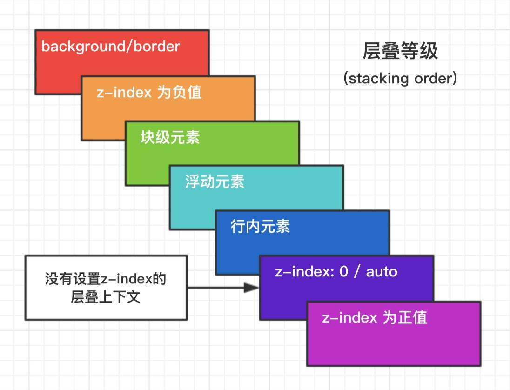

### 1. BFC
BFC(Block formatting context)直译为"块级格式化上下文"。它是一个独立的渲染区域，只有Block-level box参与， 它规定了内部的Block-level Box如何布局，并且与这个区域外部毫不相干。  

- 如何生成BFC：（脱离文档流，满足下列的任意一个或多个条件即可） 
  - 根元素，即HTML元素（最大的一个BFC）
  - float的值不为none
  - position的值为absolute或fixed
  - overflow的值不为visible（默认值。内容不会被修剪，会呈现在元素框之外）
  - display的值为inline-block、table-cell、table-caption

- BFC布局规则：
  - 内部的Box会在垂直方向，一个接一个地放置。
  - 属于同一个BFC的两个相邻的Box的margin会发生重叠
  - BFC就是页面上的一个隔离的独立容器，容器里面的子元素不会影响到外面的元素。反之也如此, 文字环绕效果，设置float
  - BFC的区域不会与float box重叠。
  - 计算BFC的高度，浮动元素也参与计算
    
- BFC作用：
  - 清除内部浮动 （撑开高度）
    - 原理: 触发父div的BFC属性，使下面的子div都处在父div的同一个BFC区域之内
  - 避免文字环绕
  - 分属于不同的BFC时，可以阻止margin重叠
  - 多列布局中使用BFC
  
### 2. 浮动(float)
- 元素"浮动"
- 脱离文档流
- 不脱离文本流
- 位置尽量靠上，并靠左或右

对自己的影响
- 形成"块"(BFC)
- 这个块会负责自己的布局，宽高由自己决定
- 比如 span 中用 float 这个span就形成了一个BFC，就可以设置宽高了

对兄弟元素的影响
- 上面一般贴非float元素
- 靠边贴float元素或边
- 不影响其他块级元素位置
- 影响其他块级元素文本

对父级元素的影响
- 从布局上"消失"
- 高度塌陷

### 3. 清除浮动
当容器的高度设置为 auto ，且容器的内容中有浮动的元素，这种情况下，容器的高度不能自动伸长
以适应内容高度，使得内容溢出到容器外面而影响（甚至破坏）布局的现象。  

- 设置父元素 overflow: hidden  
让父元素变为一个BFC。 父元素 overflow: auto/hidden。 让父元素去关注里面的高度。 
必须定义width或zoom:1，同时不能定义height，使用overflow:auto时，浏览器会自动检查浮动区域的高度

- 在结尾处添加空 div 标签 clear:both
    ```
    <div class="parent">
        <div class="left">Left</div>
        <div class="right">Right</div>
        <div class="clearfloat"></div>
    </div>
    
    <style>
        .left {float:left}
        .clearfloat{clear:both}
    </style>
    ```

- 使用伪元素清楚浮动
   ```
   .clearfloat::after {
      content: " ";
      clear: both;
      display: block;
      height: 0;
    }
    .clearfloat{zoom:1}
   ```

### 4. 单行文本溢出显示省略号
    overflow: hidden;
    white-space: no-warp;
    text-overflow: ellipsis;
    
### 5. 多行文本溢出显示省略号
    overflow:hidden;
    text-overflow: ellipsis;
    display: -webkit-box; //将对象作为弹性伸缩盒子模型显示
    -webkit-line-clamp: 2; //行数
    -webkit-box-orient: vertical; //设置或检索伸缩盒对象的子元素的排列方式

### 6. 重排和重绘
  1. 重绘(repaint): 当元素样式的改变不影响布局时，浏览器将使用重绘对元素进行更新，此时由于只需要UI层面的重新像素绘制，因此 损耗较少
  2. 重排(reflow): 当元素的尺寸、结构或触发某些属性时，浏览器会重新渲染页面，称为回流。此时，浏览器需要重新经过计算，计算后还需要重新页面布局，因此是较重的操作。会触发回流的操作:  
     1. 页面初次渲染；  
     2. 浏览器窗口大小改变；  
     3. 元素尺寸、位置、内容、字体大小发生改变；  
     4. 添加/删除可见的dom元素；  
     5. 激活Css伪类（如:hover）  
     6. 查询某些属性或使用某些方法：  
        - clientHeight、clientWidth、clientTop、clientLeft  
        - offsetHeight、offsetWidth、offsetTop、offsetLeft  
        - scrollHeight、scrollWidth、scrollTop、scrollLeft  
        - getComoutedStyle()  
        - getBoundingRect()  
        - scrollTo()  
    
  3. 回流必定触发重绘，重绘不一定触发回流。重绘的开销较小，回流的代价较高。

### 7.获取盒模型的宽高
  - dom.style.height 适用于行内样式
  - getComputedStyle(dom).width 
  - dom.currentStyle.width 获取渲染后的宽高，仅IE支持
  - getBoundingClientRect().width 计算元素的绝对位置（left, top, right, bottom)
      
### 8. 隐藏元素的方法
  - display:none;
  - opacity:0;
  - visiable:hidden;
  - transform: scale(0)
  - position:absoulte; left: -999999999
  - height:0

### 9. 层叠上下文
- 层叠上下文：元素提升为一个比较特殊的图层，在三维空间中 (z轴) 高出普通元素一等。
- 层叠上下文的触发
    - HTML中的根元素本身j就具有层叠上下文，称为“根层叠上下文”。
    - 普通元素设置position属性为非static值并设置z-index属性为具体数值，产生层叠上下文。
    - CSS3中的新属性也可以产生层叠上下文。
        - flex
        - transform
        - opacity
        - filter
        - will-change
        - -webkit-overflow-scrolling
- 层叠等级
    - 普通元素的层叠等级优先由其所在的层叠上下文决定。
    - 层叠等级的比较只有在当前层叠上下文元素中才有意义。不同层叠上下文中比较层叠等级是没有意义的。
    