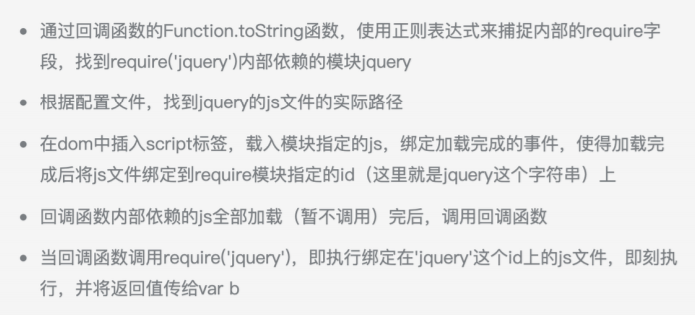

### [Promise](Promise.md)
 
### 1. let const
- 暂时性死区
  - ES6 明确规定，如果区块中存在 let 和 const 命令，这个区块对这些命令声明的变量，从⼀开始就形成了封闭作⽤域。凡是在声明之前就使⽤这些变量，就会报错。
- 不存在变量提升
- 不允许重复定义
- 块级作⽤域

Question: let、const真的不存在变量提升吗？  
答：js变量的执行过程包括三步：创建、初始化、赋值。  
- var声明的变量执行过程：找到当前作用域中所有var声明的变量，创建变量->初始化为undefined->执行代码->赋值  
- function声明的变量执行过程：找到当前作用域中所有function声明的变量，创建变量->初始化->赋值->执行代码  
- let声明的变量执行过程：找到当前作用域中所有let声明的变量，创建变量->执行代码->初始化为let声明的值，没有就为undefined->赋值  
- const声明的变量执行过程：找到当前作用域中所有let声明的变量，创建变量->执行代码->初始化为let声明的值，没有就为undefined

因此有没有被提升，主要看代码执行的时机:  
- let、const 的「创建」过程被提升了，但是初始化没有提升，另外const没有赋值过程。
- var 的「创建」和「初始化」都被提升了。
- function 的「创建」「初始化」和「赋值」都被提升了。

### 2. 箭头函数
- 箭头函数会捕获其所在上下⽂的this值，作为⾃⼰的this
- 箭头函数没有原型属性
- 箭头函数作为匿名函数，不能作为构造函数，不能使⽤new关键字
- 箭头函数不绑定arguments，⽤...扩展运算符解决
- 箭头函数不能当做Generator函数，不能使⽤yield关键字
- 使⽤call和apply调⽤时，只是传⼊了参数，对this没有影响

### 3. 模块化
- CMD和AMD
  - AMD是requireJs规范化的产物，CMD是seaJs规范化的产物
  - AMD推崇依赖前置，CMD推崇依赖就近
  - 对于依赖的模块，AMD是提前执⾏，CMD是延迟执⾏
  - AMD 的 API 默认是⼀个当多个⽤，CMD 的 API 严格区分，推崇职责单⼀。⽐如 AMD ⾥，require分全局 require 和局部 require，都叫 require。CMD ⾥，没有全局 require，⽽是根据模块系统的完备性，提供 seajs.use 来实现模块系统的加载启动。CMD ⾥，每个 API 都简单纯粹。
  - CMD延迟执⾏如何理解：http://www.imooc.com/wenda/detail/457468
  
  
- common.js
  - common.js⼤多⽤于服务器规范，node、webpack遵循commonjs
  - module.exports = ...;只能输出⼀个，下⾯的覆盖上⾯的；
  - exports.... 可以输出多个，是module.exports的引⽤；
  - 模块是对象，加载的是该对象；
  - 加载的是整个模块，即将所有接⼝全部加载进来；
  - 运⾏阶段确定接⼝，运⾏时才会加载模块；
  - 输出的是值的拷⻉；
  - this指向的是当前模块；
  
- ES6的import、export
  - export: 可以输出多个，输出⽅式为{};
  - export default: 只能输出⼀个
  - 模块不是对象，加载的不是对象
  - 可以单独加载其中的某个接⼝（⽅法）
  - 解析阶段确定对外输出的接⼝，解析阶段⽣成接⼝
  - 静态分析，动态引⽤，输出的是值的引⽤，只读
  - this指向undefined
  
- ESM和commonJs的区别
  - commonJs模块输出的是⼀个值的复制，ES6模块输出的是值的引⽤；
    - commonJs模块加载原理：commonJs的⼀个模块就是⼀个脚本⽂件，require命令第⼀次加载该脚本就会执⾏整个脚本，然后在内存中⽣成⼀个对象。以后需要⽤到这个模块时，就会到exports属性上去取值，即时再次执⾏require命令，也不会执⾏该模块，⽽是直接到缓存中去取值。commonJs模块的重要特性是加载即执⾏，即脚本在require的时候就会全部执⾏。
    - ES6模块的运⾏机制与commonJs不⼀样。js引擎对脚本静态分析的时候，遇到模块加载命令中的import就会⽣成⼀个只读引⽤。等到脚本真正执⾏时，再根据这个只读引⽤到被加载的模块中取值。ES6模块是动态引⽤，并不会缓存值，模块⾥⾯的变量绑定其所在的模块。
  - commonJs模块是运⾏时加载，ES6模块是编译时输出接⼝；
    - commonJs加载的是⼀个对象（即module.exports）属性，该对象只有在脚本运⾏结束时才会⽣成。
    - ⽽ES6模块不是对象，它的接⼝只是⼀种静态定义，在代码解析阶段就会⽣成。
  