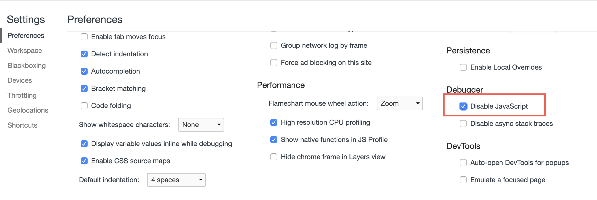

### [原型链与继承](原型链与继承.md)
### [执行环境及作用域](执行环境.md)
### [setTimeout、setInterval、requestAnimationFrame](requestAnimationFrame.md)

### 1. js的各种假值
'', false, 0, null, undefined, NaN
- false 与 0、'' 比较为true
- null 和 undefined 比较为true
- 0 和false、''、 [] 比较为true
  - ![] == false
  - [] == false
- '' 和 false、 0 比较为true
- null 和 undefined 比较为true
  - null == undefined，双等时两者相等，且除了自身，仅与null、nudefined比较会返回true
- NaN与任何值都不想等，包括自身
  - ES6 中 Object.is(NaN, NaN) 返回true

### 2. 禁止复制粘贴怎么实现以及如何破解
[参考文档](https://www.cnblogs.com/momo798/p/6797670.html)

#### 实现禁止复制粘贴
```
<style type="text/css">
/* 最简单的实现禁止复制的方法，采用css方式禁止文字选择，当然这只兼容webkit内核浏览器 */
* { -webkit-user-select: none; }
p {font-family: 'Microsoft Yahei';font-size: 28px;}
input {width: 80%; padding: 10px 20px;}
</style>
<h1>本代码在UC手机浏览器上不生效，其它手机浏览器暂未发现问题、PC全部没问题。</h1>
<p>这是一段示例文字，我无法被选中，也无法按下鼠标右键，即使被选中你也无法复制！</p>
<input type="text" value="文本框中的文字可以选中，但是无法复制粘贴"/>
<script type="text/javascript">
// 禁止右键菜单
document.oncontextmenu = function(){ return false; };
// 禁止文字选择
document.onselectstart = function(){ return false; };
// 禁止复制
document.oncopy = function(){ return false; };
// 禁止剪切
document.oncut = function(){ return false; };
// 禁止粘贴
document.onpaste = function(){ return false; };
</script>
```
#### 破解复制粘贴
绝大部分限制都是采用js实现的，那我禁用js不久OK了么？突然发现我太聪明了！假如你使用的是Chrome或者其它国产webkit内核浏览器，按下F12弹出开发者工具，再按下F1弹出设置，勾选Disable JavaScript，再按下ESC键关闭设置（其它浏览器如何禁止JavaScript请自行研究），然后试试是不是可以复制了？

如果此时仍无法选择文字，找到你要复制文字的地方，看看是不是添加了-webkit-user-select: none的样式，如果有，将其去掉即可

### 3. js各种循环性能对比

- #### 正序和倒序，倒序循环是编程语言中常用的性能优化方法  

    通常不会感觉到性能差异，但是在数据量很大时中，比如下面的代码：
      
    ```
    var arr=[]
    for (var i = 0; i < 1000000; i++) {
    arr[i] = i;
    }
    var start = +new Date();
    for (var j = 0; j < arr.length; j++) {
    arr[j] = j;
    }
    console.log("for正序序循环耗时：%s ms", Date.now() - start);
    var start = +new Date();
    for (var j = arr.length-1; j>-1; j--) {
    arr[j] = j;
    }
    console.log("for倒序循环耗时：%s ms", Date.now() - start); 
    var start = +new Date();
    arr.forEach((v,index)=>{
    v=index
    })
    console.log("foreach循环耗时：%s ms", Date.now() - start);
    ```
    
    经测试，
    
    循环1万次，输出：  
    for正序序循环耗时：1 ms  
    for倒序循环耗时：1 ms  
    foreach循环耗时：1 ms
    
    循环10万次，输出： 
    for正序序循环耗时：5 ms  
    for倒序循环耗时：3 ms  
    foreach循环耗时：2 ms 
    
    循环1百万次，输出： 
    for正序序循环耗时：20 ms  
    for倒序循环耗时：5 ms  
    foreach循环耗时：21 ms 
    
    循环1千万次，输出;  
    for正序序循环耗时：176 ms  
    for倒序循环耗时：25 ms  
    foreach循环耗时：217 ms  

- #### 如果缓存数组长度

    ```
    var arr=[]
    for (var i = 0; i < 10000000; i++) {
    arr[i] = i;
    }
    var start = +new Date();
    for (var j = 0; j < length; j++) {
    arr[j] = j;
    }
    console.log("for正序序循环耗时：%s ms", Date.now() - start);
    var start = +new Date();
    for (var j = length-1; j>-1; j--) {
    arr[j] = j;
    }
    console.log("for倒序循环耗时：%s ms", Date.now() - start); 
    ```
    
    把之前的arr.length换成length，输出： 
    for正序序循环耗时：0 ms  
    for倒序循环耗时：0 ms  
    性能得到了很大提升。 
    
    总结： 
    1.大数据量循环，尽量用倒序排序，至于倒序为什么性能更好，有知道的可以留言  
    2.for和foreach的性能相近，在数据量很大，比如一千万时，foreach因为内部封装，比for更耗时  
    3.减少对象成员和数组项的查找，比如缓存数组长度，避免每次查找数组 length 属性 

### 4. 深拷贝与浅拷贝
- 浅拷贝: 以赋值的形式拷贝引用对象，仍指向同一个地址，修改时原对象也会受到影响

    - Object.assign
    - 展开运算符(...)
    
    注：这两个一级深拷贝，下级浅拷贝

- 深拷贝: 完全拷贝一个新对象，修改时原对象不再受到任何影响

    - JSON.parse(JSON.stringify(obj)): 性能最快
        - 具有循环引用的对象时，报错
        - 当值为函数、undefined、或symbol时，无法拷贝
    - 递归进行逐一赋值
    
 实现一个深拷贝：  
 [参考文档](https://juejin.im/post/5d6aa4f96fb9a06b112ad5b1)
 

### 5. js处理异步的方式
- 回调函数
- 事件监听
- 观察者模式
- 发布/订阅模式
- [promise](../ES6/Promise.md)
- async/await  
    在函数声明前写async代表这是一个异步函数，里面有await关键字，会等当前语句执行完毕才会往下执行。