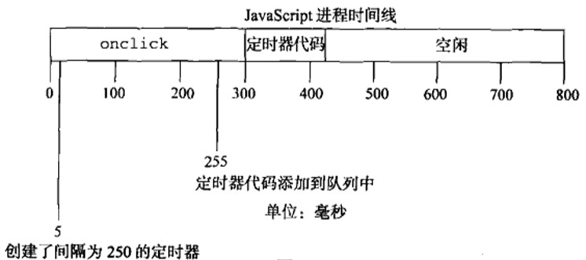
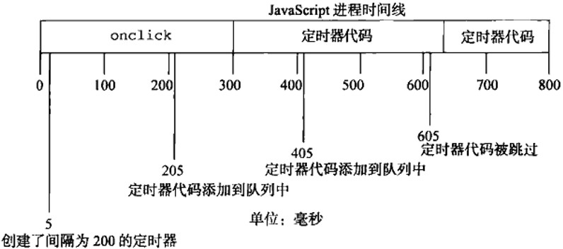
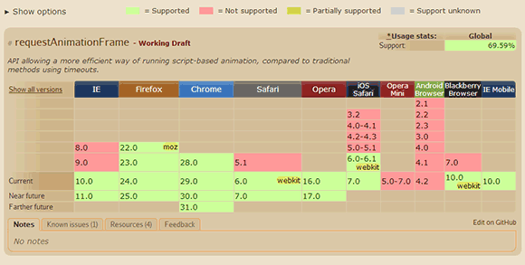

### setTimeout、setInterval和requestAnimationFrame
[参考文档](https://www.cnblogs.com/luoyanan/p/8436127.html)

#### setTimeout()
setTimeout()方法用来指定某个函数或字符串在指定的毫秒数之后执行。它返回一个整数，表示定时器的编号，这个值可以传递给clearTimeout()用于取消这个函数的执行  
以下代码中，控制台先输出0，大概过1000ms即1s后，输出定时器setTimeout()方法的返回值1

    var Timer = setTimeout(function(){
        console.log(Timer);
    },1000);
    console.log(0);
    
如果省略setTimeout的第二个参数，则该参数默认为0

#### clearTimeout()
setTimeout函数返回一个表示计数器编号的整数值，将该整数传入clearTimeout函数，取消对应的定时器  

    //过100ms后，控制台输出setTimeout()方法的返回值1
    var Timer = setTimeout(function(){
        console.log(Timer);
    },100);
    
于是可以利用这个值来取消对应的定时器

    var Timer = setTimeout(function(){
        console.log(Timer);
    },100);
    clearTimeout(Timer);
或者直接使用返回值作为参数

    var Timer = setTimeout(function(){
        console.log(Timer);
    },100);
    clearTimeout(1);
一般来说，setTimeout返回的整数值是连续的，也就是说，第二个setTimeout方法返回的整数值比第一个的整数值大1

    //控制台输出1、2、3
    var Timer1 = setTimeout(function(){
        console.log(Timer1);
    },100);
    var Timer2 = setTimeout(function(){
        console.log(Timer2);
    },100);
    var Timer3 = setTimeout(function(){
        console.log(Timer3);
    },100);
    
#### setInterval()
setInterval的用法与setTimeout完全一致，区别仅仅在于setInterval指定某个任务每隔一段时间就执行一次，也就是无限次的定时执行

    <button id="btn">0</button>
    
    
HTML5标准规定，setTimeout的最短时间间隔是4毫秒；setInterval的最短间隔时间是10毫秒，也就是说，小于10毫秒的时间间隔会被调整到10毫秒  
大多数电脑显示器的刷新频率是60HZ，大概相当于每秒钟重绘60次。因此，最平滑的动画效的最佳循环间隔是1000ms/60，约等于16.6ms  

#### 运行机制
下面例子中，控制台会先输出0，再输出1。

    setTimeout(function(){
        console.log(1);
    });
    console.log(0);
实际上，把setTimeout的第二个参数设置为0s，并不是立即执行函数的意思，只是把函数放入异步队列。浏览器先执行完同步队列里的任务，才会去执行异步队列中的任务  

在下面这个例子中，给一个按钮btn设置了一个事件处理程序。事件处理程序设置了一个250ms后调用的定时器。点击该按钮后，首先将onclick事件处理程序加入队列。该程序执行后才设置定时器，再有250ms后，指定的代码才被添加到队列中等待执行

    btn.onclick = function(){
        setTimeout(function(){
            console.log(1);
        },250);
    }
如果上面代码中的onclick事件处理程序执行了300ms，那么定时器的代码至少要在定时器设置之后的300ms后才会被执行。队列中所有的代码都要等到javascript进程空闲之后才能执行，而不管它们是如何添加到队列中的

如图所示，尽管在255ms处添加了定时器代码，但这时候还不能执行，因为onclick事件处理程序仍在运行。定时器代码最早能执行的时机是在300ms处，即onclick事件处理程序结束之后

**setInterval()的问题**  
setInterval定时器是等到回调执行完，才开始计时进行下次循环呢？还是只要一次计时完毕，插入回调之后不管回调执不执行就开始计时呢  

答案是后者，定时器代码可能在代码再次被添加到队列之前还没有完成执行，结果导致定时器代码连续运行好几次，而之间没有任何停顿。而javascript引擎对这个问题的解决是：当使用setInterval()时，仅当没有该定时器的任何其他代码实例时，才将定时器代码添加到队列中。这确保了定时器代码加入到队列中的最小时间间隔为指定间隔  

但是，这样会导致两个问题：1、某些间隔被跳过；2、多个定时器的代码执行之间的间隔可能比预期的小   

假设，某个onclick事件处理程序使用setInterval()设置了200ms间隔的定时器。如果事件处理程序花了300ms多点时间完成，同时定时器代码花了400ms的时间，就会同时出现跳过某间隔的情况

例子中的第一个定时器是在205ms处添加到队列中的，但是直到过了300ms处才能执行。当执行这个定时器代码时，在405ms处又给队列添加了另一个副本。在下一个间隔，即605ms处，第一个定时器代码仍在运行，同时在队列中已经有了一个定时器代码的实例。结果是，在这个时间点上的定时器代码不会被添加到队列中

**迭代setTimeout**
为了避免setInterval()定时器的问题，可以使用链式setTimeout()调用

    setTimeout(function fn(){
     setTimeout(fn,interval);
    },interval);
这个模式链式调用了setTimeout()，每次函数执行的时候都会创建一个新的定时器。第二个setTimeout()调用当前执行的函数，并为其设置另外一个定时器。这样做的好处是，在前一个定时器代码执行完之前，不会向队列插入新的定时器代码，确保不会有任何缺失的间隔。而且，它可以保证在下一次定时器代码执行之前，至少要等待指定的间隔，避免了连续的运行。

#### setTimeout（setInterval）来实现动画
**动画原理**  

我们在浏览器中看到的图像是在以每秒60次的频率刷新的，由于刷新频率很高，因此你感觉不到它在刷新。而动画本质就是要让人眼看到图像被刷新而引起变化的视觉效果，这个变化要以连贯的、平滑的方式进行过渡。 那怎么样才能做到这种效果呢？

刷新频率为60Hz的屏幕每16.7ms刷新一次，我们在屏幕每次刷新前，将图像的位置向左移动一个像素，即1px。这样一来，屏幕每次刷出来的图像位置都比前一个要差1px，因此你会看到图像在移动；由于我们人眼的视觉停留效应，当前位置的图像停留在大脑的印象还没消失，紧接着图像又被移到了下一个位置，因此你才会看到图像在流畅的移动，这就是视觉效果上形成的动画。

**setTimeout（setInterval）的缺点**  

理解了上面的概念以后，我们不难发现，setTimeout 其实就是通过设置一个间隔时间来不断的改变图像的位置，从而达到动画效果的。但我们会发现，利用seTimeout实现的动画在某些低端机上会出现卡顿、抖动的现象。 这种现象的产生有两个原因：

- setTimeout的执行时间并不是确定的。在Javascript中， setTimeout 任务被放进了异步队列中，只有当主线程上的任务执行完以后，才会去检查该队列里的任务是否需要开始执行，因此 setTimeout 的实际执行时间一般要比其设定的时间晚一些。
- 刷新频率受屏幕分辨率和屏幕尺寸的影响，因此不同设备的屏幕刷新频率可能会不同，而 setTimeout只能设置一个固定的时间间隔，这个时间不一定和屏幕的刷新时间相同。

以上两种情况都会导致setTimeout的执行步调和屏幕的刷新步调不一致，从而引起丢帧现象。 那为什么步调不一致就会引起丢帧呢？

首先要明白，setTimeout的执行只是在内存中对图像属性进行改变，这个变化必须要等到屏幕下次刷新时才会被更新到屏幕上。如果两者的步调不一致，就可能会导致中间某一帧的操作被跨越过去，而直接更新下一帧的图像。假设屏幕每隔16.7ms刷新一次，而setTimeout每隔10ms设置图像向左移动1px， 就会出现如下绘制过程：

第0ms: 屏幕未刷新，等待中，setTimeout也未执行，等待中；  
第10ms: 屏幕未刷新，等待中，setTimeout开始执行并设置图像属性left=1px；  
第16.7ms: 屏幕开始刷新，屏幕上的图像向左移动了1px， setTimeout 未执行，继续等待中；  
第20ms: 屏幕未刷新，等待中，setTimeout开始执行并设置left=2px;  
第30ms: 屏幕未刷新，等待中，setTimeout开始执行并设置left=3px;  
第33.4ms:屏幕开始刷新，屏幕上的图像向左移动了3px， setTimeout未执行，继续等待中；  
…  

从上面的绘制过程中可以看出，屏幕没有更新left=2px的那一帧画面，图像直接从1px的位置跳到了3px的的位置，这就是丢帧现象，这种现象就会引起动画卡顿。

所以，使用window.setInterval()或者window.setTimeout()制作的动画，有如下缺点：
- 他们都是通用的方法，并不是专为绘制动画而用
- 即使向其专递以毫秒为单位的参数值，它们也达不到毫秒级的准确性
- 没有对调用动画循环的机制优化
- 不考虑绘制动画的最佳时机，而只会一味地以某个大致的时间间隔调用动画循环。

#### requestAnimationFrame
什么是requestAnimationFrame？  
MDN API文档解释如下：https://developer.mozilla.org/zh-CN/docs/Web/API/Window/requestAnimationFrame

简单来说，requestAnimationFrame方法用于通知浏览器重采样动画。  
当requestAnimationFrame(callback)被调用时不会执行callback，而是会将元组< handle,callback>插入到动画帧请求回调函数列表末尾（其中元组的callback就是传入requestAnimationFrame的回调函数），并且返回handle值，该值为浏览器定义的、大于0的整数，唯一标识了该回调函数在列表中位置。  
每个回调函数都有一个布尔标识cancelled，该标识初始值为false，并且对外不可见。  
浏览器在执行“采样所有动画”的任务时会遍历动画帧请求回调函数列表，判断每个元组的callback的cancelled，如果为false，则执行callback。

cancelAnimationFrame 方法用于取消先前安排的一个动画帧更新的请求。
当调用cancelAnimationFrame(handle)时，浏览器会设置该handle指向的回调函数的cancelled为true。
无论该回调函数是否在动画帧请求回调函数列表中，它的cancelled都会被设置为true。
如果该handle没有指向任何回调函数，则调用cancelAnimationFrame 不会发生任何事情。

当页面可见并且动画帧请求回调函数列表不为空时，浏览器会定期地加入一个“采样所有动画”的任务到UI线程的队列中。 

这个API的调用很简单，如下所示：

    var progress = 0;
    //回调函数
    function render() {
        progress += 1; //修改图像的位置
        if (progress < 100) {
               //在动画没有结束前，递归渲染
               window.requestAnimationFrame(render);
        }
    }
    //第一帧渲染
    window.requestAnimationFrame(render);

cancelAnimationFrame的使用方法也很简单

    function a(time) {
        console.log("animation");
        id = window.requestAnimationFrame(a);
    }

    a();
    window.cancelAnimationFrame(id);
 
与setTimeout相比，requestAnimationFrame最大的优势是由系统来决定回调函数的执行时机。具体一点讲，如果屏幕刷新率是60Hz,那么回调函数就每16.7ms被执行一次，如果刷新率是75Hz，那么这个时间间隔就变成了1000/75=13.3ms，换句话说就是，requestAnimationFrame的步伐跟着系统的刷新步伐走。它能保证回调函数在屏幕每一次的刷新间隔中只被执行一次，这样就不会引起丢帧现象，也不会导致动画出现卡顿的问题。

除此之外，requestAnimationFrame还有以下两个优势：

- CPU节能：使用setTimeout实现的动画，当页面被隐藏或最小化时，setTimeout 仍然在后台执行动画任务，由于此时页面处于不可见或不可用状态，刷新动画是没有意义的，完全是浪费CPU资源。而requestAnimationFrame则完全不同，当页面处理未激活的状态下，该页面的屏幕刷新任务也会被系统暂停，因此跟着系统步伐走的requestAnimationFrame也会停止渲染，当页面被激活时，动画就从上次停留的地方继续执行，有效节省了CPU开销。
- 函数节流：在高频率事件(resize,scroll等)中，为了防止在一个刷新间隔内发生多次函数执行，使用requestAnimationFrame可保证每个刷新间隔内，函数只被执行一次，这样既能保证流畅性，也能更好的节省函数执行的开销。一个刷新间隔内函数执行多次时没有意义的，因为显示器每16.7ms刷新一次，多次绘制并不会在屏幕上体现出来。

#### 优雅降级
浏览器兼容性：

由于requestAnimationFrame目前还存在兼容性问题，而且不同的浏览器还需要带不同的前缀。因此需要通过优雅降级的方式对requestAnimationFrame进行封装，优先使用高级特性，然后再根据不同浏览器的情况进行回退，直止只能使用setTimeout的情况。

所以，如果想要简单的兼容，可以这样子：

    window.requestAnimFrame = (function(){
         return  window.requestAnimationFrame       ||
              window.webkitRequestAnimationFrame ||
              window.mozRequestAnimationFrame    ||
              function( callback ){
                window.setTimeout(callback, 1000 / 60);
              };
    })();
    
但是呢，并不是所有设备的绘制时间间隔是1000/60 ms, 以及上面并木有cancel相关方法，所以，就有下面这份更全面的兼容方法：

    (function() {
        var lastTime = 0;
        var vendors = ['webkit', 'moz'];
        for(var x = 0; x < vendors.length && !window.requestAnimationFrame; ++x) {
            window.requestAnimationFrame = window[vendors[x] + 'RequestAnimationFrame'];
            window.cancelAnimationFrame = window[vendors[x] + 'CancelAnimationFrame'] ||    // Webkit中此取消方法的名字变了
                                          window[vendors[x] + 'CancelRequestAnimationFrame'];
        }
    
        if (!window.requestAnimationFrame) {
            window.requestAnimationFrame = function(callback, element) {
                var currTime = new Date().getTime();
                var timeToCall = Math.max(0, 16.7 - (currTime - lastTime));
                var id = window.setTimeout(function() {
                    callback(currTime + timeToCall);
                }, timeToCall);
                lastTime = currTime + timeToCall;
                return id;
            };
        }
        if (!window.cancelAnimationFrame) {
            window.cancelAnimationFrame = function(id) {
                clearTimeout(id);
            };
        }
    }());
