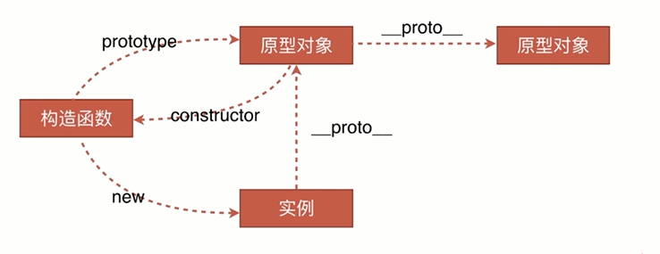

### 1. 原型
- JavaScript 的所有对象中都包含了一个 __proto__ 内部属性，这个属性所对应的就是该对象的原型
- JavaScript 的函数对象，除了原型 __proto__ 之外，还预置了 prototype 属性
- 当函数对象作为构造函数创建实例时，该 prototype 属性值将被作为实例对象的原型 __proto__。



### 2. 原型链
任何一个实例对象通过原型链可以找到它对应的原型对象，原型对象上面的实例和方法都是实例所共享的。  
一个对象在查找以一个方法或属性时，他会先在自己的对象上去找，找不到时，他会沿着原型链依次向上查找。  
注意： 函数才有prototype，实例对象只有有__proto__， 而函数有的__proto__是因为函数是Function的实例对象

### 3. instanceof原理
判断实例对象的__proto__属性与构造函数的prototype是不是用一个引用。如果不是，他会沿着对象的__proto__向上查找的，直到顶端Object

自实现：
```
function _instanceof(target, origin){
    while(target){
        if(Object.getPrototypeOf(target) === origin){
            return true;
        }
        target = Object.getPrototypeOf(target);
    }
    return false;
}
```

### 4. new操作符干了什么
- 创建一个新的对象 obj;
- 将这个空对象的__proto__成员指向了Constructor函数对象prototype成员对象
- Base函数对象的this指针替换成obj, 相当于执行了Constructor.call(obj);
- 如果构造函数显示的返回一个对象，那么则这个实例为这个返回的对象。 否则返回这个新创建的对象

```
function _new(Constructor, ...args){
    let obj = {};
    Object.setPrototypeOf(obj, Constructor);
    let res = Constructor.apply(obj, args);
    return typeof res === 'object' ? res : obj;
}
```

### 5. Js继承
- 原型链继承 
  ```
  Child.prototype = new Father();  
  ```
  可继承的属性：子类构造函数中的属性、父类构造函数中的属性、父类原型属性  
  无法向父构造函数传参，所有实例会共享原型属性，继承单一
 
- 借用构造函数继承  
  ```
  Father.call(Child) 
  ``` 
  可继承的属性：子类构造函数中的属性、父类构造函数中的属性  
  可以向父类构造函数传参，但每个实例都有父类构造函数的副本，没有复用父类构造函数，每次调用都会执行父类构造函数

- 组合继承
  ```
  Child.prototype = new Father();
  Father.call(Child)
  ```
  可以继承父类原型伤的属性，可以传参，可复用。
  调用了两次父类构造函数，子类的构造函数会代替父类构造函数

- 原型式继承
  ```
  function create(object){
      let F = function(){};
      F.prototype = object;
      return new F();
  }
  ```
  所有实例都会继承原型上的属性，无法复用。

- 寄生组合式继承
  ```
  Father.call(Child)
  Child.prototype = create(Father)
  ```
  1、函数的原型等于另一个实例。2、在函数中用apply或者call引入另一个构造函数，可传参　

- 圣杯模式
  ```
  let inherit = function(child, father) {
      let F = function () {
      };
      return function (child, father) {
          F.prototype = father.prototype;
          child.prototype = new F();
          child.uber = father.prototype;
          child.prototype.constructor = child;
      }
  }();
  ```
