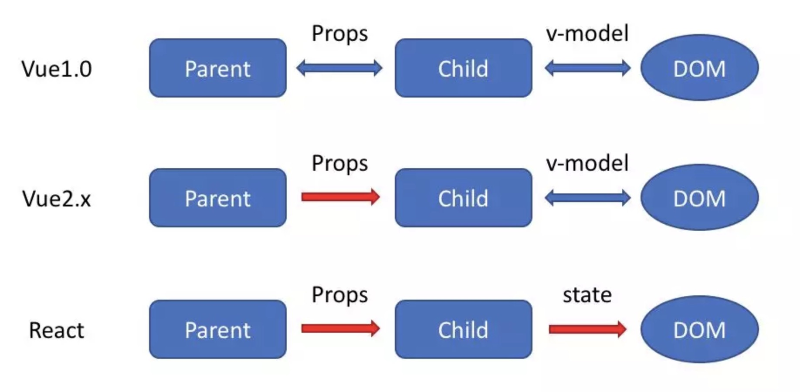

## 1. vue和react的异同点和优势对比

抄录自http://caibaojian.com/vue-vs-react.html
https://juejin.im/post/5b8b56e3f265da434c1f5f76

###(1) 相同点

- #### 虚拟DOM

    虚拟Dom是Dom树的虚拟表现，他的诞生是因为这样一个情况：改变真实DOM状态远比改变一个JS对象的花销大得多。
    
    Virtual DOM是一个映射真实DOM的JavaScript对象，如果需要改变任何元素的状态，那么是先在Virtual DOM上进行改变，
    而不是直接改变真实的DOM。当有变化产生时，一个新的Virtual DOM对象会被创建并计算新旧Virtual DOM之间的差别。
    之后这些差别会应用在真实的DOM上。

    例子如下，我们可以看看下面这个列表在HTML中的代码是如何写的：
    ```
    <ul class="list">
      <li>item 1</li>
      <li>item 2</li>
    </ul>
    ```
   
    而在JavaScript中，我们可以用对象简单地创造一个针对上面例子的映射：
    ```
    {
        type: 'ul', 
        props: {'class': 'list'}, 
        children: [
            { type: 'li', props: {}, children: ['item 1'] },
            { type: 'li', props: {}, children: ['item 2'] }
        ]
    }
    ```
    
    当新一项被加进去这个JavaScript对象时，一个函数会计算新旧Virtual DOM之间的差异并反应在真实的DOM上。
    计算差异的算法是高性能框架的秘密所在，React和Vue在实现上有点不同。
    
    Vue宣称可以更快地计算出Virtual DOM的差异，这是由于它在渲染过程中，会跟踪每一个组件的依赖关系，不需要重新渲染整个组件树。
    
    而对于React而言，每当应用的状态被改变时，全部子组件都会重新渲染。
    当然，这可以通过shouldComponentUpdate这个生命周期方法来进行控制，但Vue将此视为默认的优化。


- #### 组件化

    React与Vue都鼓励组件化应用。这本质上说，是建议你将你的应用分拆成一个个功能明确的模块，
    每个模块之间可以通过合适的方式互相联系。关于组件化的例子可以在这篇文章的中间部分被找到:
    
    >你可以认为组件就是用户界面中的一小块。如果让我来设计Facebook的UI界面，那么聊天窗口会是一个组件，
    评论会是另一个组件，不断更新的好友列表也会作为一个组件。

    在Vue中，如果你遵守一定的规则，你可以使用单文件组件.HTML, JavaScript和CSS都写在一个文件之中。
    你不再需要在.vue组件文件中引入CSS，虽然这也是可以的。
    
    React也是非常相似的，JavaScript与JSX被写入同一个组件文件中。


- #### Props
    
    在上面两个例子中，我们可以看到React和Vue都有'props'的概念，这是properties的简写。
    props在组件中是一个特殊的属性，允许父组件往子组件传送数据。
    
    ```
    Object.keys(this.state.pastadishes).map(key =>
        <PastaItem index={key} key={key} details={this.state.pastadishes[key]} addToOrder={this.addToOrder} orders={this.state.orders[key]} />
    )
    ```
    
    上面的JSX库组中，index, key, details, orders 与 addToOrder都是props，数据会被下传到子组件PastaItem中去。
    
    在React中，这是必须的，它依赖一个“单一数据源”作为它的“状态”（稍后有更多介绍）。
    
    而在Vue中，props略有不同。它们一样是在组件中被定义，但Vue依赖于模板语法，你可以通过模板的循环函数更高效地展示传入的数据。

    ```
    <pasta-item v-for="(item, key) in samplePasta" :item="item" :key="key" @order="handleOrder(key)"></pasta-item>
    ```
    
    这是模板的实现，但这代码完全能工作，然而在React中展现相同数据会更麻烦一点。


- #### 构建工具

    React和Vue都有自己的构建工具，你可以使用它快速搭建开发环境。React可以使用Create React App (CRA)，而Vue对应的则是vue-cli。
    两个工具都能让你得到一个根据最佳实践设置的项目模板。
    
    
- #### Chrome开发工具

    React和Vue都有很好的Chrome扩展工具去帮助你找出bug。它们会检查你的应用，让你看到Vue或者React中的变化。你也可以看到应用中的状态，并实时看到更新。
    
    
- #### 配套框架
    
    Vue与React最后一个相似但略有不同之处是它们配套框架的处理方法。相同之处在于，两个框架都专注于UI层，其他的功能如路由、状态管理等都交由同伴框架进行处理。
    
    而不同之处是在于它们如何关联它们各自的配套框架。Vue的核心团队维护着vue-router和vuex，它们都是作为官方推荐的存在。而React的react-router和react-redux则是由社区成员维护，它们都不是官方维护的。


###（2）主要区别

- #### 模版语法 VS JSX
    
    React与Vue最大的不同是模板的编写。Vue鼓励你去写近似常规HTML的模板。写起来很接近标准HTML元素，只是多了一些属性。
    
    ```
    <ul>
        <template v-for="item in items">
            <li>{{ item.msg }}</li>
            <li class="divider"></li>
        </template>
    </ul>
    ```
    
    这些属性也可以被使用在单文件组件中，尽管它需要在在构建时将组件转换为合法的JavaScript和HTML。
    
    ```
    <ul>
      <pasta-item v-for="(item, key) in samplePasta" :item="item" :key="key" @order="handleOrder(key)"></pasta-item>
    </ul>
    ```
    
    Vue鼓励你去使用HTML模板去进行渲染，使用相似于Angular风格的方法去输出动态的内容。因此，通过把原有的模板整合成新的Vue模板，Vue很容易提供旧的应用的升级。这也让新来者很容易适应它的语法。
    
    另一方面，React推荐你所有的模板通用JavaScript的语法扩展——JSX书写。同样的代码，用JSX书写的例子如下:

    ```
    <ul className="pasta-list">
        {
            Object.keys(this.state.pastadishes).map(key =>
                <PastaItem index={key} key={key} details={this.state.pastadishes[key]} addToOrder={this.addToOrder} orders={this.state.orders[key]} />
            )
        }
    </ul>
    ```
    
    React/JSX乍看之下，觉得非常啰嗦，但使用JavaScript而不是模板来开发，赋予了开发者许多编程能力。
    
    在深层上，模板的原理不同，这才是他们的本质区别：
    
    - React是在组件JS代码中，通过原生JS实现模板中的常见语法，比如插值，条件，循环等，都是通过JS语法实现的
    - Vue是在和组件JS代码分离的单独的模板中，通过指令来实现的，比如条件语句就需要 v-if 来实现

    值得一提的是，与React一样，Vue在技术上也支持render函数和JSX，但只是不是默认的而已。
    

- #### 状态管理 VS 对象属性

    如果你对React熟悉，你就会知道应用中的状态是（React）关键的概念。也有一些配套框架被设计为管理一个大的state对象，如Redux。此外，state对象在React应用中是不可变的，
    意味着它不能被直接改变（这也许不一定正确）。在React中你需要使用setState()方法去更新状态。
    
     ```
     addToOrder(key) {
            //Make a copy of this.state
            const orders = { ...this.state.orders };
    
            //update or add
            orders[ key ] = orders[ key ] + 1 || 1;
            this.setState( { orders } );
     }
     ```
     
     在Vue中，state对象并不是必须的，数据由data属性在Vue对象中进行管理。

    ```
    export default {
      name: 'app',
      data() {
        return {
          samplePasta: samplePasta,
          orders: {}
        }
      },
    ...
      methods: {
        handleOrder: function (key) {
    
          if (!this.orders.hasOwnProperty(key)) {
            this.$set(this.orders, key, { count: 0 });
          }
    
          this.orders[key].count += 1;
        }
      }
    }
    ```
    
    而在Vue中，则不需要使用如setState()之类的方法去改变它的状态，在Vue对象中，data参数就是应用中数据的保存者。
    
    对于管理大型应用中的状态这一话题而言，Vue.js的作者尤雨溪曾说过，（Vue的）解决方案适用于小型应用，但对于对于大型应用而言不太适合。
    
    >多数情况下，框架内置的状态管理是不足以支撑大型应用的，Redux或Vuex等状态管理方案是必须使用的。
    
    有鉴于此，争论你的应用中如何管理状态很可能属于过早优化，并且这很可能只是个人偏好问题。此外，你可能真没必要担心这方面。

    从表面上来说，store 注入和使用方式有一些区别。
    
    在 Vuex 中，$store 被直接注入到了组件实例中，因此可以比较灵活的使用：
    - 使用 dispatch 和 commit 提交更新
    - 通过 mapState 或者直接通过 this.$store 来读取数据
    
    在 Redux 中，我们每一个组件都需要显示的用 connect 把需要的 props 和 dispatch 连接起来。
    
    另外 Vuex 更加灵活一些，组件中既可以 dispatch action 也可以 commit updates，而 Redux 中只能进行 dispatch，并不能直接调用 reducer 进行修改。
    
    从实现原理上来说，最大的区别是两点：
    - Redux 使用的是不可变数据，而Vuex的数据是可变的。Redux每次都是用新的state替换旧的state，而Vuex是直接修改
    - Redux 在检测数据变化的时候，是通过 diff 的方式比较差异的，而Vuex其实和Vue的原理一样，是通过 getter/setter来比较的（如果看Vuex源码会知道，其实他内部直接创建一个Vue实例用来跟踪数据变化）
    
    而这两点的区别，其实也是因为 React 和 Vue的设计理念上的区别。React更偏向于构建稳定大型的应用，非常的科班化。
    相比之下，Vue更偏向于简单迅速的解决问题，更灵活，不那么严格遵循条条框框。因此也会给人一种大型项目用React，
    小型项目用 Vue 的感觉。
    

- #### 监听数据变化的实现原理不同

    - Vue 通过 getter/setter 以及一些函数的劫持，能精确知道数据变化，不需要特别的优化就能达到很好的性能
    - React 默认是通过比较引用的方式进行的，如果不优化（PureComponent/shouldComponentUpdate）可能导致大量不必要的VDOM的重新渲染
    
    为什么 React 不精确监听数据变化呢？这是因为 Vue 和 React 设计理念上的区别，Vue 使用的是可变数据，而React更强调数据的不可变。
    所以应该说没有好坏之分，Vue更加简单，而React构建大型应用的时候更加鲁棒。
      
- #### 数据流的不同
    
    
    
    大家都知道Vue中默认是支持双向绑定的。在Vue1.0中我们可以实现两种双向绑定：
    - 父子组件之间，props 可以双向绑定
    - 组件与DOM之间可以通过 v-model 双向绑定
    
    在 Vue2.x 中去掉了第一种，也就是父子组件之间不能双向绑定了（但是提供了一个语法糖自动帮你通过事件的方式修改），并且 Vue2.x 已经不鼓励组件对自己的 props 进行任何修改了。所以现在我们只有 组件 <--> DOM 之间的双向绑定这一种。
    
    然而 React 从诞生之初就不支持双向绑定，React一直提倡的是单向数据流，他称之为 onChange/setState()模式。
    
    不过由于我们一般都会用 Vuex 以及 Redux 等单向数据流的状态管理框架，因此很多时候我们感受不到这一点的区别了。
    
- #### HoC 和 mixins

    在 Vue 中我们组合不同功能的方式是通过 mixin，而在React中我们通过 HoC (高阶组件）。
    
    React 最早也是使用 mixins 的，不过后来他们觉得这种方式对组件侵入太强会导致很多问题，就弃用了 mixinx 转而使用 HoC，
    关于mixin究竟哪里不好，可以参考React官方的这篇文章 Mixins Considered Harmful
    
    而 Vue 一直是使用 mixin 来实现的。为什么 Vue 不采用 HoC 的方式来实现呢？
    高阶组件本质就是高阶函数，React 的组件是一个纯粹的函数，所以高阶函数对React来说非常简单。
    但是Vue就不行了，Vue中组件是一个被包装的函数，并不简单的就是我们定义组件的时候传入的对象或者函数。
    比如我们定义的模板怎么被编译的？比如声明的props怎么接收到的？这些都是vue创建组件实例的时候隐式干的事。
    由于vue默默帮我们做了这么多事，所以我们自己如果直接把组件的声明包装一下，返回一个高阶组件，
    那么这个被包装的组件就无法正常工作了。
   
   
### (3) vue vs react
与React相比，Vue.js的下载量更少，并且主要用于构建有吸引力的单页面应用程序和Web应用程序。但是，Vue.js具有适应性强
的体系结构，使其成为广泛使用的框架之一，具有最新的库和包。

- #### 使用React.js的公司
    Facebook，Instagram，Netflix，纽约时报，雅虎，WhatsApp，Codecademy，Dropbox，Airbnb，Asana，微软

- #### 使用Vue.js的公司
    Facebook，Netflix，Adobe，Grammarly，Behance，小米，阿里巴巴，Codeship，Gitlab和Laracasts

- #### React.js的优点：
    灵活性和响应性：它提供最大的灵活性和响应能力。虚拟DOM：由于它基于文档对象模型，因此它允许浏览器友好地以HTML，
    XHTML或XML格式排列文档。丰富的JavaScript库：来自世界各地的贡献者正在努力添加更多功能。可扩展性：
    由于其灵活的结构和可扩展性，React已被证明对大型应用程序更好。不断发展： React得到了Facebook专业开发人
    员的支持，他们不断寻找改进方法。Web或移动平台： React提供React Native平台，可通过相同的React组件模型为
    iOS和Android开发本机呈现的应用程序。无论是Web还是本机移动开发，React都是大多数用户界面设计平台的理想选择。

- #### React.js的缺点：
    陡峭的学习曲线：由于复杂的设置过程，属性，功能和结构，它需要深入的知识来构建应用程序。

- #### 使用Vue.Js的优点
    易于使用： Vue.js包含基于HTML的标准模板，可以更轻松地使用和修改现有应用程序。更顺畅的集成：无论是单页应
    用程序还是复杂的Web界面，Vue.js都可以更平滑地集成更小的部件，而不会对整个系统产生任何影响。更好的性能，
    更小的尺寸：它占用更少的空间，并且往往比其他框架提供更好的性能。精心编写的文档：通过详细的文档提供简单的学习曲线，
    无需额外的知识; HTML和JavaScript将完成工作。适应性：整体声音设计和架构使其成为一种流行的JavaScript框架。
    它提供无障碍的迁移，简单有效的结构和可重用的模板。

- #### 使用Vue.js的缺点
    与Angular和React相比，Vue.js框架的市场份额仍然很小。它正在快速流行，但与此同时，在使用Vue.js时，
    可能会出现大规模应用程序开发方面的问题。
    
- #### 何时使用Vue.js Over React
    如果您想要一个轻量级，更快速，更现代的UI库来制作一流的SPA（单页面应用程序），您应该选择Vue.js. 
    对于习惯使用HTML的开发人员来说，这是有利的。此外，它还提供了组件的可重用性，使其成为开发人员在Web应用程序中构建
    无与伦比的用户体验的选择。

- #### 何时选择React Over Vue.js
    当你是JavaScript的粉丝！React拥有一个成熟且规模更大的专业开发团队，致力于使其更先进。React由Facebook提供支持，
    其中包含许多用例，解决方案，资源和项目。此外，由于成熟的用户群，React适用于大规模应用程序和移动应用程序。
    很明显，如果您想使用JavaScript构建移动应用程序，React Native绝对是您的选择。
    但是，要么是构建现代JavaScript应用程序的一个很好的选择，它高度依赖于团队，应用程序大小和可行的方法。 
