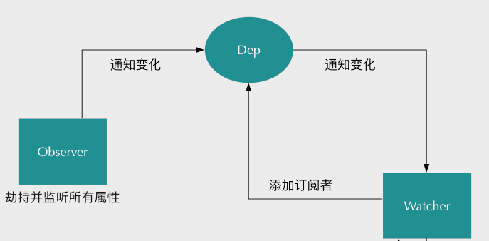

### [Vue VS React](VueVsReact.md)
### [Vue生命周期函数](lifeCycle.md)
### [Vue通信方式](communication.md)

### 1. Vue.nextTick()
vue在更新DOM时是异步执行的，只要侦听到数据变化，vue将开启一个队列，并缓冲在同一事件循环中所发生的
所有数据变更。如果一个watcher被多次触发，只会被推入到队列中一次。这种在缓冲时去除重复数据对于避免
不必要的计算和DOM操作时非常重要的。然后在下一个事件循环tick中，vue刷新队列并执行实际（已去重）工作。  

vue在内部对异步队列尝试使用原生的Promise.then、MutationObserver和setImmediate，如果执行环境不支持，
则会采用setTimeout(fn, 0)代替。

当你设置vm.someDate = 'new value'，该组件不会立即重新渲染。当刷新队列时，组件会在下一个事件循环
'tick'中更新。多数情况我们不需要关心这个过程，但是如果你想基于更新后的DOM状态来做点什么，这就可能
会有点棘手。虽然vue.js通常鼓励开发人员使用“数据驱动”的方式思考，避免直接接触DOM，但是有时我们
必须要这么做。为了在数据变化之后等待Vue完成更新DOM，可以在数据变化之后理解使用Vue.nextTick(callback).
这样回调函数将在DOM更新完成后被调用。nextTick()返回一个promise对象。

### 2. 双向绑定原理
[参考文档](https://www.cnblogs.com/wangjiachen666/p/9883916.html)

实现数据的双向绑定，首先要对数据进行劫持监听，核心是Object.defineProperty这个方法。我们需要设置一个监听器
Observer，用来监听所有属性。如果属性发上变化了，就需要告诉订阅者Watcher看是否需要更新。因为订阅者是有很多个，
所以我们需要有一个消息订阅器Dep来专门收集这些订阅者，然后在监听器Observer和订阅者Watcher之间进行统一管理的。

  

- Observe(监听器)监听props和state
    - 遍历props和state，对每个属性创建单独的订阅器
- 使用defineProperty重写每个属性的get/set
    - get：收集依赖
    - set：派发更新

index.html
```
<!DOCTYPE html>
<html lang="en">
<head>
    <meta charset="UTF-8">
    <title>Document</title>
</head>
<body>
    <h1 id="name"></h1>
    <input type="text">
    <input type="button" value="改变data内容" onclick="changeInput()">
    
<script src="observer.js"></script>
<script src="watcher.js"></script>
<script>
    function myVue (data, el, exp) {
        this.data = data;
        observable(data);                      //将数据变的可观测
        el.innerHTML = this.data[exp];           // 初始化模板数据的值
        new Watcher(this, exp, function (value) {
            el.innerHTML = value;
        });
        return this;
    }

    var ele = document.querySelector('#name');
    var input = document.querySelector('input');
    
    var myVue = new myVue({
        name: 'hello world'
    }, ele, 'name');
    
    //改变输入框内容
    input.oninput = function (e) {
        myVue.data.name = e.target.value
    }
    //改变data内容
    function changeInput(){
        myVue.data.name = "难凉热血"
    
    }
</script>
</body>
</html>
```

observer.js
```
/**
 * 把一个对象的每一项都转化成可观测对象
 * @param { Object } obj 对象
 */
function observable (obj) {
    if (!obj || typeof obj !== 'object') {
        return;
    }
    let keys = Object.keys(obj);
    keys.forEach((key) =>{
        defineReactive(obj,key,obj[key])
    })
    return obj;
}
/**
 * 使一个对象转化成可观测对象
 * @param { Object } obj 对象
 * @param { String } key 对象的key
 * @param { Any } val 对象的某个key的值
 */
function defineReactive (obj,key,val) {
    let dep = new Dep();
    Object.defineProperty(obj, key, {
        get(){
            dep.depend();
            console.log(`${key}属性被读取了`);
            return val;
        },
        set(newVal){
            val = newVal;
            console.log(`${key}属性被修改了`);
            dep.notify()                    //数据变化通知所有订阅者
        }
    })
}
class Dep {
    
    constructor(){
        this.subs = []
    }
    //增加订阅者
    addSub(sub){
        this.subs.push(sub);
    }
    //判断是否增加订阅者
    depend () {
        if (Dep.target) {
            this.addSub(Dep.target)
        }
    }

    //通知订阅者更新
    notify(){
        this.subs.forEach((sub) =>{
            sub.update()
        })
    }
    
}
Dep.target = null;
```

watcher.js
```
class Watcher {
    constructor(vm,exp,cb){
        this.vm = vm;
        this.exp = exp;
        this.cb = cb;
        this.value = this.get();  // 将自己添加到订阅器的操作
    }
    get(){
        Dep.target = this;  // 缓存自己
        let value = this.vm.data[this.exp]  // 强制执行监听器里的get函数
        Dep.target = null;  // 释放自己
        return value;
    }
    update(){
        let value = this.vm.data[this.exp];
        let oldVal = this.value;
        if (value !== oldVal) {
            this.value = value;
            this.cb.call(this.vm, value, oldVal);
        }
    }
}
```

### 3. key (number | string)
key的特殊属性主要用在vue的虚拟DOM算法，在新旧nodes对比时辨识VNodes。如果不适用key，Vue会使用一种最大限度
减少动态元素并且尽可能的尝试修复/再利用相同类型元素的算法。使用key，它会基于key的变化重新排列元素顺序，并
且会移除key不存在的元素。

有相同父元素的子元素必须有独特的key，重复的key会造成渲染错误。  
最常见的用例是结合v-for:
```
<ul>
    <li v-for="item in items" :key="item.id">...</li>
</ul>
```
它也可以用于强制替换元素/组件而不是重复使用它。当你遇到如下场景时它可能会很有用：
- 完整地触发组件地生命周期钩子
- 触发过渡  

例如：
```
<transition>
    <span :key="text">{{ text }}</span>
</transition
```
当text发生改变时，`<span>`会随时被更新，因此会触发过渡。

### 4. 虚拟DOM
- 创建虚拟dom树
- 树的diff，平层对比，输出patchs(listDiff/diffChildren/diffProps)
    - 没有新的节点，返回
    - 新的节点tagName和key不变，对比props，继续递归遍历子树
        - 对比属性（对比新旧属性列表）
            - 旧属性是否存在在新属性列表中
            - 都存在的是否有变化
            - 是否出现旧列表中没有的新属性
    - tagName和key值变化了，直接替换成新节点
- 渲染差异
    - 遍历patchs，把需要更改的节点取出来
    - 局部更新DOM 

```
// diff算法的实现
function diff(oldTree, newTree) {
    // 差异收集
    let pathchs = {}
    dfs(oldTree, newTree, 0, pathchs)
    return pathchs
}

function dfs(oldNode, newNode, index, pathchs) {
    let curPathchs = []
    if (newNode) {
        // 当新旧节点的 tagName 和 key 值完全⼀致时
        if (oldNode.tagName === newNode.tagName && oldNode.key === newNode.key) {
            // 继续⽐对属性差异
            let props = diffProps(oldNode.props, newNode.props)
            curPathchs.push({ type: 'changeProps', props })
            // 递归进⼊下⼀层级的⽐较
            diffChildrens(oldNode.children, newNode.children, index, pathchs)
        } else {
            // 当 tagName 或者 key 修改了后，表⽰已经是全新节点，⽆需再⽐
            curPathchs.push({ type: 'replaceNode', node: newNode })
        }
    }
    // 构建出整颗差异树
    if (curPathchs.length) {
        if(pathchs[index]){
            pathchs[index] = pathchs[index].concat(curPathchs)
        } else {
            pathchs[index] = curPathchs
        }
    }
}

// 属性对⽐实现
function diffProps(oldProps, newProps) {
    let propsPathchs = []
    // 遍历新旧属性列表
    // 查找删除项
    // 查找修改项
    // 查找新增项
    forin(oldProps, (k, v) => {
        if (!newProps.hasOwnProperty(k)) {
            propsPathchs.push({ type: 'remove', prop: k })
        } else {
            if (v !== newProps[k]) {
                propsPathchs.push({ type: 'change', prop: k , value: newProps[k] })
            }
        }
    })
    forin(newProps, (k, v) => {
        if (!oldProps.hasOwnProperty(k)) {
            propsPathchs.push({ type: 'add', prop: k, value: v })
        }
    })
    return propsPathchs
}
// 对⽐⼦级差异
function diffChildrens(oldChild, newChild, index, pathchs) {
    // 标记⼦级的删除/新增/移动
    let { change, list } = diffList(oldChild, newChild, index, pathchs)
    if (change.length) {
        if (pathchs[index]) {
            pathchs[index] = pathchs[index].concat(change)
        } else {
            pathchs[index] = change68 }
        }
    }
    // 根据 key 获取原本匹配的节点，进⼀步递归从头开始对⽐
    oldChild.map((item, i) => {
        let keyIndex = list.indexOf(item.key)
        if (keyIndex) {
            let node = newChild[keyIndex]
            // 进⼀步递归对⽐
            dfs(item, node, index, pathchs)
        }
    })
}

// 列表对⽐，主要也是根据 key 值查找匹配项
// 对⽐出新旧列表的新增/删除/移动
function diffList(oldList, newList, index, pathchs) {
    let change = []
    let list = []
    const newKeys = getKey(newList)
    oldList.map(v => {
        if (newKeys.indexOf(v.key) > -1) {
            list.push(v.key)
        } else {
            list.push(null)
        }
    })
    // 标记删除
    for (let i = list.length - 1; i>= 0; i--) {
        if (!list[i]) {
            list.splice(i, 1)
            change.push({ type: 'remove', index: i })
        }
    }
    // 标记新增和移动
    newList.map((item, i) => {
        const key = item.key
        const index = list.indexOf(key)
        if (index === -1 || key == null) {
            // 新增
            change.push({ type: 'add', node: item, index: i })
            list.splice(i, 0, key)
        } else {
            // 移动
            if (index !== i) {
                change.push({ type: 'move', form: index, to: i, })
                move(list, index, i)
            }
        }
    })
    return { change, list }
}
```

### 5. Proxy相比于defineProperty的优势
- 数组变化也能监听到
- 不需要深度遍历监听

```
let data = { a: 1 }
let reactiveData = new Proxy(data, {
    get: function(target, name){
        // ...
    },
    // ...
})
```

### 6. vue-router
官网：https://router.vuejs.org/zh/

- mode
    - hash
    - history
- 跳转
    - this.$router.push()
    - `<router-link to=""></router-link>`
- 占位
    - `<router-view></router-view>`
    
### 7. v-for 数组更新检测
#### 变异方法 (mutation method)
Vue 将被侦听的数组的变异方法进行了包裹，所以它们也将会触发视图更新。这些被包裹过的方法包括：
```
push()
pop()
shift()
unshift()
splice()
sort()
reverse()
```
你可以打开控制台，然后对前面例子的 items 数组尝试调用变异方法。比如 `example1.items.push({ message: 'Baz' })`。

#### 替换数组
变异方法，顾名思义，会改变调用了这些方法的原始数组。相比之下，也有非变异 (non-mutating method) 方法，例如 filter()、concat() 和 slice() 。它们不会改变原始数组，而总是返回一个新数组。当使用非变异方法时，可以用新数组替换旧数组：
```
 example1.items = example1.items.filter(function (item) {
   return item.message.match(/Foo/)
 })
```
你可能认为这将导致 Vue 丢弃现有 DOM 并重新渲染整个列表。幸运的是，事实并非如此。Vue 为了使得 DOM 元素得到最大范围的重用而实现了一些智能的启发式方法，所以用一个含有相同元素的数组去替换原来的数组是非常高效的操作。

#### 注意事项
由于 JavaScript 的限制，Vue 不能检测以下数组的变动：

- 当你利用索引直接设置一个数组项时，例如：`vm.items[indexOfItem] = newValue`  

- 当你修改数组的长度时，例如：`vm.items.length = newLength`  

举个例子：
```
var vm = new Vue({
  data: {
    items: ['a', 'b', 'c']
  }
})
vm.items[1] = 'x' // 不是响应性的
vm.items.length = 2 // 不是响应性的
```
为了解决第一类问题，以下两种方式都可以实现和 `vm.items[indexOfItem] = newValue` 相同的效果，同时也将在响应式系统内触发状态更新：
```
// Vue.set
Vue.set(vm.items, indexOfItem, newValue)
// Array.prototype.splice
vm.items.splice(indexOfItem, 1, newValue)
```
你也可以使用 vm.$set 实例方法，该方法是全局方法 Vue.set 的一个别名：  
`vm.$set(vm.items, indexOfItem, newValue)`

为了解决第二类问题，你可以使用 splice：  
`vm.items.splice(newLength)`

