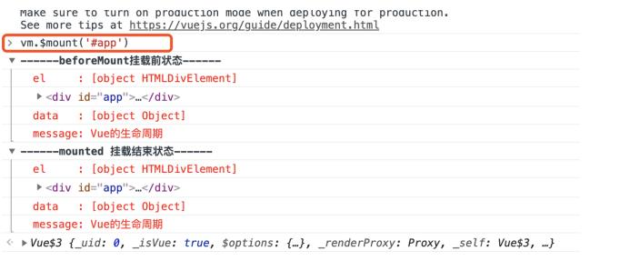

### vue生命周期
vue实例有一个完整的生命周期，也就是从开始创建、初始化数据、编译模板、挂在Dom->渲染、更新->渲染、
卸载等一系列过程，我们称这是vue的生命周期。通俗说就是vue实例从创建到销毁的过程，就是生命周期。


先来一波代码：
```
var vm = new Vue({
    el: '#app',
    data: {
        message: 'Vue的⽣命周期'
    },
    beforeCreate: function() {
        console.group('------beforeCreate创建前状态------');
        console.log("%c%s", "color:red" , "el : " + this.$el); //undefined
        console.log("%c%s", "color:red","data : " + this.$data); //undefined
        console.log("%c%s", "color:red","message: " + this.message)
        console.groupEnd() ;
    },
    created: function() {
        console.group('------created创建完毕状态------');
        console.log("%c%s", "color:red","el : " + this.$el); //undefined
        console.log("%c%s", "color:red","data : " + this.$data); //已被初始化
        console.log("%c%s", "color:red","message: " + this.message); //已被初始化
        console.groupEnd() ;
    },
    beforeMount: function() {
        console.group('------beforeMount挂载前状态------');
        console.log("%c%s", "color:red","el : " + (this.$el)); //已被初始化
        console.log(this.$el);
        console.log("%c%s", "color:red","data : " + this.$data); //已被初始化
        console.log("%c%s", "color:red","message: " + this.message); //已被初始化
        console.groupEnd() ;
    },
    mounted: function() {
        console.group('------mounted 挂载结束状态------');
        console.log("%c%s", "color:red","el : " + this.$el); //已被初始化
        console.log(this.$el);
        console.log("%c%s", "color:red","data : " + this.$data); //已被初始化
        console.log("%c%s", "color:red","message: " + this.message); //已被初始化
        console.groupEnd() ;
    },
    beforeUpdate: function () {
        console.group('beforeUpdate 更新前状态===============》');
        console.log("%c%s", "color:red","el : " + this.$el);
        console.log(this.$el);
        console.log("%c%s", "color:red","data : " + this.$data);
        console.log("%c%s", "color:red","message: " + this.message);
        console.groupEnd() ;
    },
    updated: function () {
        console.group('updated 更新完成状态===============》');
        console.log("%c%s", "color:red","el : " + this.$el);
        console.log(this.$el);
        console.log("%c%s", "color:red","data : " + this.$data);
        console.log("%c%s", "color:red","message: " + this.message);
        console.groupEnd() ;
    },
    beforeDestroy: function () {
        console.group('beforeDestroy 销毁前状态===============》');
        console.log("%c%s", "color:red","el : " + this.$el);
        console.log(this.$el);
        console.log("%c%s", "color:red","data : " + this.$data);
        console.log("%c%s", "color:red","message: " + this.message);
        console.groupEnd() ;
    },
    destroyed: function () {
        console.group('destroyed 销毁完成状态===============》');
        console.log("%c%s", "color:red","el : " + this.$el);
        console.log(this.$el);
        console.log("%c%s", "color:red","data : " + this.$data);
        console.log("%c%s", "color:red","message: " + this.message)
        console.groupEnd() ;
    }
})
```

### 1.1 生命周期   
##### 1.1.1 beforeCreate-created间的生命周期

 
 
在这个生命周期之间，进行初始化事件。

  

通过代码结果可知：在beforeCreated钩子执行时，$el、$data以及message都为undefined,created的时候
$data及message已经有内容了，只是组件还没有挂载到元素上。
    
##### 1.1.2 created-beforeMount间的生命周期

  

在这一阶段中会进行两次判断：  
- 首先判断是否有‘el’选项？如果有的话就继续向下编译，如果没有el选项，则停止编译。也就意味着
停止了生命周期，直到在该vue实例上在此调用vm.$mount(el)才会继续往下编译。
    - 在这先把代码中的el注释掉，执行结果如下：
    
      
    
    当$el不挂载到vue时，只会进行beforeCreated和created这两个钩子函数，不会进行beforeMount和
    mounted钩子函数。
    - 然后在控制台输入vm.$mount('app')后执行结果如下：
    
      
    
    这里就可以继续执行了。

- 第二判断是否有‘template’模板？如果有的话直接通过渲染函数渲染出来。如果没有的话，就直接调用$el的外部html进行渲染。
    ```   
    <div id="app">
         <h1>{{message}} 这是在HTML中的</h1>
    </div>
    
    <script>
     var vm = new Vue({
         el: '#app',
         template: "<h1>{{message +'这是在template中的'}}</h1>",
         data: {
         message: 'Vue的⽣命周期'
         }
     })
    </script>
    ```
    执行结果：
    - 如果vue实例对象中有template参数选项，则将其作为模板编译成为render函数。
    - 如果没有template选项，则将外部html作为模板编译。
    - 可以看到template中的模板优先级要高于外部html的优先级。

    另外，vue对象中也有render函数，和template一样，render可以返回一个createElement参数，进行渲染。
    ```
    var vm = new Vue({
        el: '#app',
        render: function(createElement) {
            return createElement('h1', 'this is createElement')
        },
        data: {
            message: 'Vue的⽣命周期'
        }
    })
    ```
    所以综合排名优先级：render函数>template选项>外部html.

##### 1.1.3 beforeMount-mounted钩子函数的生命周期  

  

这个生命周期在于虚拟DOM的渲染。  

  

在beforeMounted钩子函数中，挂载了$el，但只拿到{{message}}，没有完成渲染，而mounted钩子函数是
已经完成了整个流程。

##### 1.1.4 beforeUpdate-updated间的生命周期

  

这一步是当vue的data数据发生改变，就会触发对应组件的重新渲染。然后依次触发beforeUpdate和update钩子函数。

  

**PS：** 这俩钩子函数只能在已渲染到模板里的数据发生改变后才能触发，否则不触发。


##### 1.1.5 beforeDestroy-destroyed间的生命周期

  

beforeDestroy钩子函数在实例销毁之前调用。在这一步，实例仍然完全可用。destroyed钩子函数在vue实例
销毁后调用。调用后，Vue实例上的所有东西都会解绑，所有事件监听器会被移除，所有的子实例也会被销毁。

### 1.2 生命周期钩子
1.2.1 beforeCreate:  
- 完成实例初始化，初始化非响应式变量；
- this指向创建的实例；
- 可以在这加个loading事件；
- data computed watch methods上的方法和数据均不能访问；

1.2.2 created:
- 实例创建完成；
- 完成数据（data、props、computed）的初始化，导入依赖项；
- 可访问data、computed、watch、methods上的方法和数据；
- 未挂载DOM，不能访问$el，$ref为空数组；
- 可以在这结束loading，还做一些初始化操作等；
- 可以对data数据进行操作，可进行一些请求，请求不易过多，避免白屏时间太长。
- 若在此阶段进行的DOM操作一定要放在vue.nextTick()的回调函数中。

1.2.3 beforeMount:
- 有了$el，编译了template/外部html;
- 能找到对应的template，并编译成render函数；

1.2.4 mounted:
- 完成创建vm.$el和双向绑定；
- 完成挂载DOM和渲染；
- 可对挂载的DOM进行操作；
- 有了DOM，完成了双向绑定，可访问DOM节点、$ref;
- 可在这发起后端请求，拿回数据，配合路由钩子做一些事情；

1.2.5 beforeUpdate:
- 数据更新之前
- 可在更新前访问现有的DOM，如手动移除添加的事件监听器；

1.2.6 updated:
- 完成虚拟DOM的重新渲染和打补丁；
- 组件DOM已完成更新；
- 可执行依赖的DOM操作；
- **PS:** 不要在此钩子中操作数据，会陷入死循环

1.2.7 beforeDestory:
- 执行destroy之前可做一些删除提示；
- 可用于销毁定时器，解绑全局事件，销毁插件对象；

1.2.8 destroyed:
- 当前组件已被删除，销毁监听事件，组件、事件、子实例也被销毁；
- 这时组件已经没有了，无法操作里面的任何东西；
