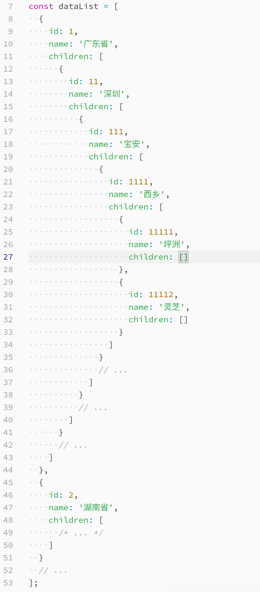

#### 1. 从二叉树的根到叶子节点称为一条路径，路径上每个节点的value之和为路径和值，本题要求所有的路径中是否存在一条和值为N的路径
（头条）
```
// node节点构造函数
function Node(value){
    this.value = value;
    this.left = null;
    this.right = null;
}

// 方法实现
function findRoad(root, total){
    if(root === null){
        return [];
    }
    let res = [];
    computedTree(root, [], 0, res, total);
    return res;
}

function computedTree(node, path, sum, res, total){
    if(node === null){
        return ;
    }

    let newPath = path.concat(node.value);
    sum += node.value;
    if(node.left === null && node.right === null && sum === total){
        res.push(newPath);
        return ;
    }
    computedTree(node.left, newPath, sum, res, total);
    computedTree(node.right, newPath, sum, res, total);
}
```
#### 2. 写一个function find(dataList, where){},找到dataList中指定where的数据（阿里）
where结构 {id: 111}


```
function find(dataList, where){
    const {id} = where;
    const len = dataList.length;

    for(let i = 0; i < len; i ++){
        if (dataList[i].id === id) {
            return dataList[i];
        } else if (dataList[i].children.length) {
            let res = find(dataList[i].children, where);
            if(res) {
                return res;
            }
        }
    }
    return null;
}
```

#### 3. 数组的最大深度
    function maxDeep(array, depth = 1){
        let arr = array.filter(item => Array.isArray(item));
        if(arr.length){
            return Math.max(...arr.map(item => maxDeep(item, depth + 1)));
        }
        return depth;
    }
    
#### 4. 数组的最长递归子序列(猿辅导)
    function findMaxSub(arr){
        let res = [];
        for(let i = 0; i < arr.length; i ++){
            res[i] = [arr[i]];
            for(let j = 0; j < i; j ++){
                if((arr[j] < arr[i]) && (res[j].length + 1 > res[i].length)){
                    res[i] = [...res[j], arr[i]];
                }
            }
        }
        return res.reduce((pre, cur) => {
            return pre.length > cur.length ? pre : cur;
        }, []);
    }

#### 5. 无序数组中两个值的和等于给定值
    function findTarget(arr, target){
        let map = {};
        let res = [];
        arr.forEach(item => {
            if(map[item]){
                res.push([target-item, item]);
            } else {
                map[target-item] = true;
            }
        });
        return res;
    }